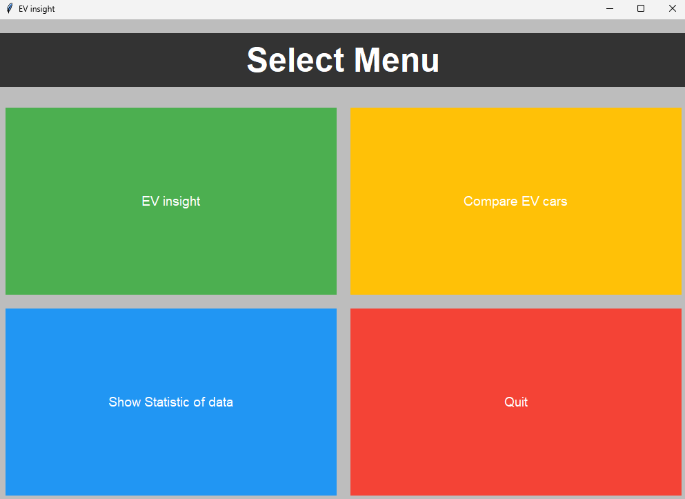
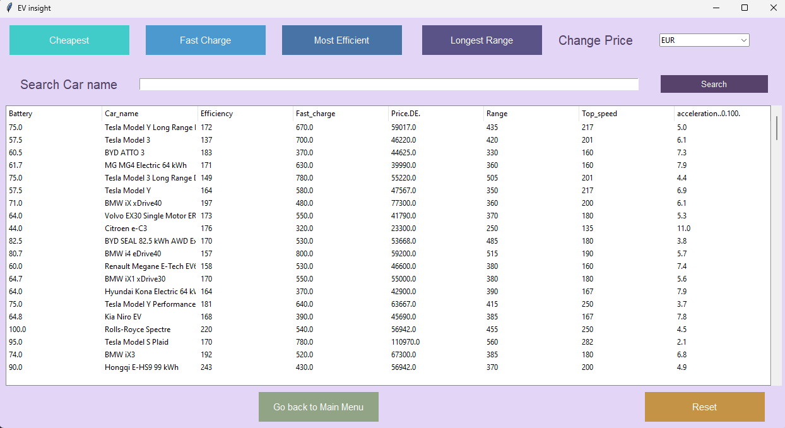
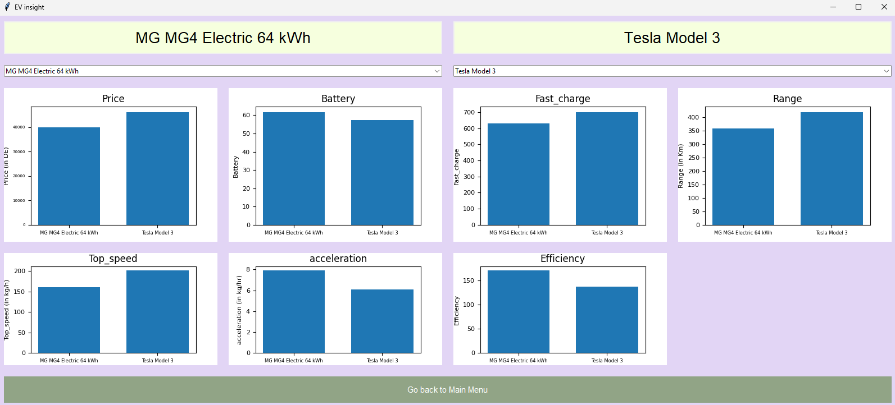
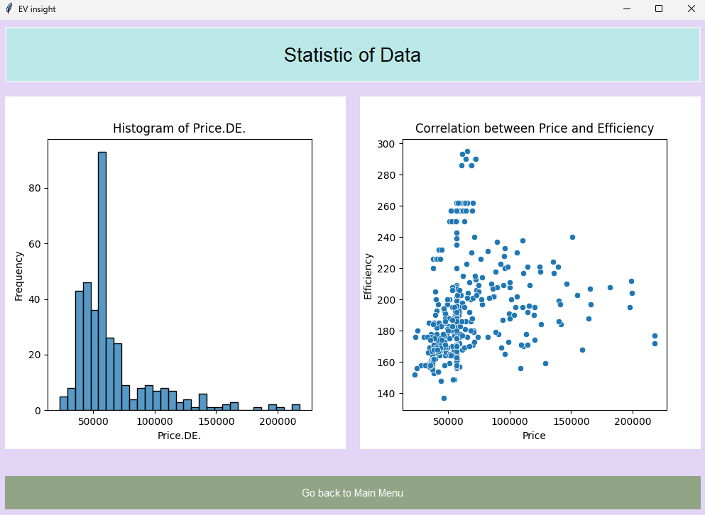

# EV-Insight

## Description
EV-Insight is a program that allows users to find information of 
different EV car and can also compare attribute of 2 cars to help users 
choose the best EV cars for them.
Main Menu

Insight Menu

Compare Menu

Statistic Menu

## Data Sources
200k+ homes for sale in Thailand dataset from https://www.kaggle.com/datasets/fatihilhan/electric-vehicle-specifications-and-prices/data.
This dataset encompasses a rich array of information crucial for understanding 
the landscape of electric mobility. Each entry includes details on the 
vehicle's battery capacity, model name, link to the EV Database for additional 
information, efficiency ratings, fast-charging capabilities, pricing in 
Germany, range, top speed, and acceleration from 0 to 100 km/h.

## Code Structure
1. [main.py](main.py) : run program
2. [GUI.py](GUI.py) : contain all of GUI
3. [conversion_rate.py](conversion_rate.py) : contain data class of conversion rate
4. [graph_plot.py](graph_plot.py) : contain class graph plot
5. [read_data.py](read_data.py) : contain class Data
6. [search_data.py](search_data.py) : contain class process and calculation.

## Installation, GitHub Wiki
[GitHub Wiki Home](https://github.com/Pong50887/EV-Insight/wiki)

